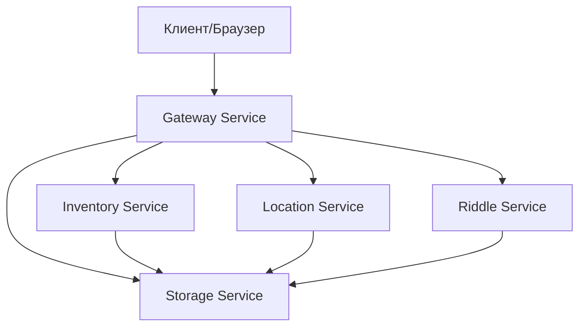
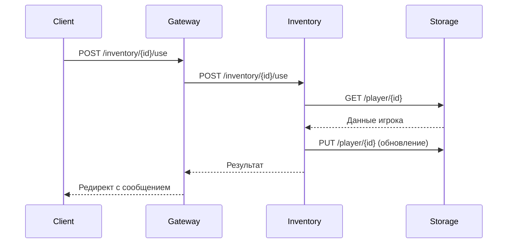
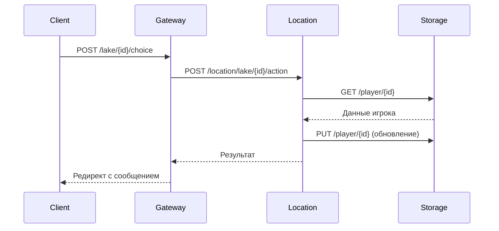
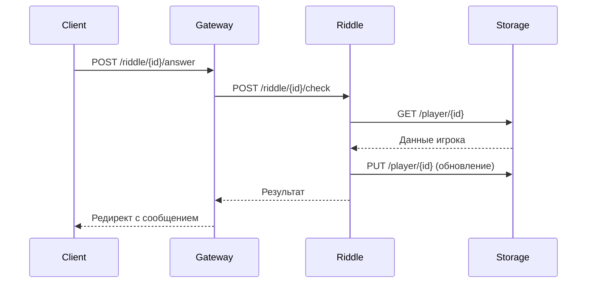

# Текстовая RPG игра на микросервисах

Многопользовательская текстовая RPG игра, построенная на микросервисной архитектуре с использованием FastAPI и Docker.

## Архитектура

Система состоит из 5 микросервисов:

1. **Gateway Service** (порт 8000)
   - Входная точка для клиентов
   - Обработка HTTP запросов
   - Маршрутизация к другим сервисам
   - HTML шаблоны и интерфейс

2. **Storage Service** (порт 8001)
   - Хранение данных игроков
   - Управление состоянием игры
   - Центральное хранилище

3. **Inventory Service** (порт 8002)
   - Управление инвентарем
   - Использование предметов
   - Эффекты предметов

4. **Riddle Service** (порт 8003)
   - Загадки
   - Проверка ответов
   - Награды за правильные ответы

5. **Location Service** (порт 8004)
   - Локации игры
   - Действия в локациях
   - Взаимодействие с окружением

### Схема взаимодействия сервисов



### Примеры взаимодействия

1. **Использование предмета:**


2. **Действие на озере:**


3. **Проверка загадки:**


## Требования

- Docker
- Docker Compose
- Python 3.11+

## Установка и запуск

1. Клонируйте репозиторий:
```bash
git clone <repository-url>
cd game
```

2. Запустите сервисы через Docker Compose:
```bash
docker-compose up --build
```

3. Откройте игру в браузере:
```
http://localhost:8000
```

## Игровой процесс

### Предметы
- **Зелье**: +10 маны
- **Руна**: +50 здоровья
- **Ключ**: +150 здоровья

### Локации
#### Озеро
- **Вперед**: Риск (-20 здоровья)
- **Направо**: Находка руны (+10 маны)
- **Налево**: Использование зелья или урон
- **Назад**: Находка зелья

### Характеристики игрока
- Здоровье
- Мана
- Инвентарь
- Опыт
- Золото

## API Endpoints

### Gateway Service
- `GET /` - Главная страница
- `POST /start` - Новая игра
- `GET /game/{player_id}` - Игровой экран
- `GET /inventory/{player_id}` - Инвентарь
- `POST /inventory/{player_id}/use` - Использование предмета
- `GET /lake/{player_id}` - Локация озера
- `GET /riddle/{player_id}` - Загадки

### Storage Service
- `GET /player/{player_id}` - Получение данных игрока
- `PUT /player/{player_id}` - Обновление данных
- `DELETE /player/{player_id}` - Удаление игрока

### Inventory Service
- `POST /inventory/{player_id}/use` - Использование предмета
- `POST /inventory/{player_id}/delete` - Удаление предмета

### Location Service
- `GET /location/lake` - Информация о локации
- `POST /location/lake/{player_id}/action` - Действие в локации

### Riddle Service
- `GET /riddle/random` - Случайная загадка
- `POST /riddle/{player_id}/check` - Проверка ответа

## Структура проекта

```
game/
├── docker-compose.yml
├── README.md
├── gateway/
│   ├── gateway.py
│   ├── requirements.txt
│   ├── Dockerfile
│   └── templates/
├── storage_service/
│   ├── main.py
│   ├── requirements.txt
│   └── Dockerfile
├── inventory_service/
│   ├── main.py
│   ├── requirements.txt
│   └── Dockerfile
├── location_service/
│   ├── main.py
│   ├── requirements.txt
│   └── Dockerfile
└── riddle_service/
    ├── main.py
    ├── requirements.txt
    └── Dockerfile
```

## Разработка

### Добавление нового сервиса

1. Создайте новую директорию для сервиса
2. Добавьте необходимые файлы:
   - main.py
   - requirements.txt
   - Dockerfile
3. Обновите docker-compose.yml
4. Добавьте интеграцию в gateway

### Обновление существующего сервиса

1. Внесите изменения в код
2. Обновите версии зависимостей если нужно
3. Пересоберите контейнеры:
```bash
docker-compose down
docker-compose up --build
```

## Технологии

- FastAPI
- Docker
- Python 3.11
- Jinja2 Templates
- httpx
- uvicorn 